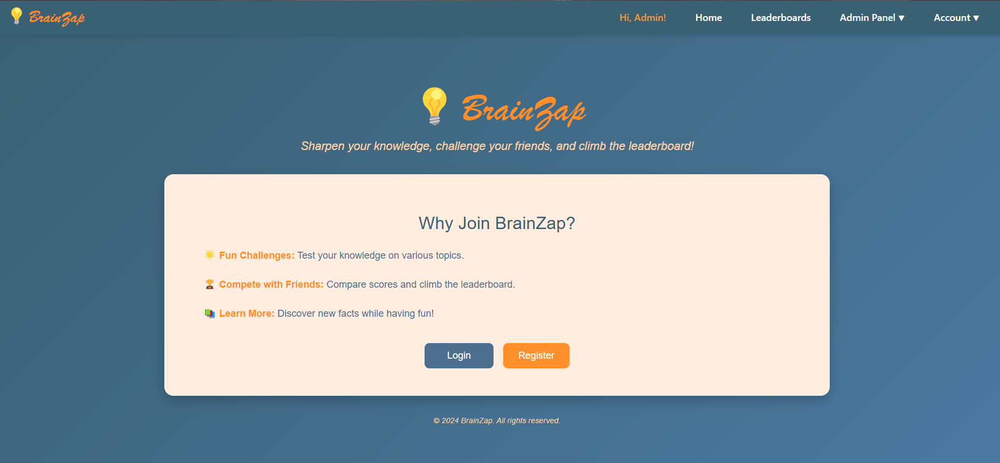
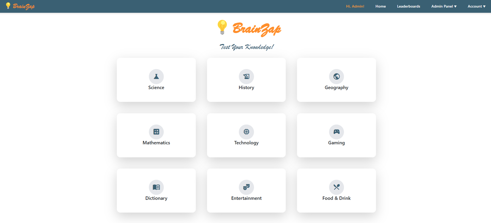
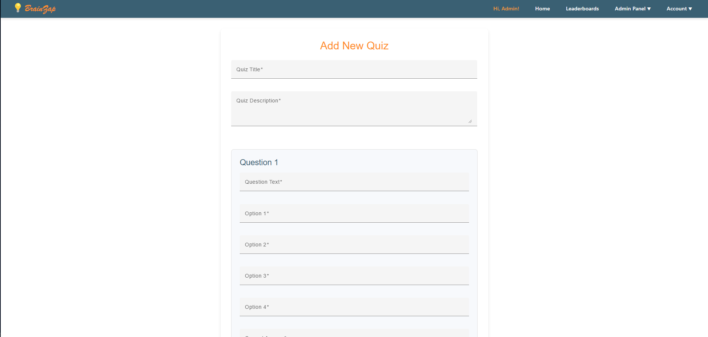

# BrainZap: Interactive Quiz Application

Sharpen your knowledge, challenge your friends, and climb the leaderboard with **💡BrainZap** – an engaging platform that combines fun, competition, and learning.

## Overview

BrainZap is a full-stack web application designed to provide an interactive quiz experience for users. Users can take quizzes on various topics, compete with others on leaderboards, and learn in an enjoyable manner. Admins have advanced features to manage users and quizzes efficiently.

## Features

### User Features
- **Interactive Quizzes:** Participate in quizzes across multiple categories, such as Science, History, Geography, and Technology.
- **Leaderboards:** Compete with others and track your scores on the leaderboard.
- **Personalized Quiz Results:** Review detailed feedback and correct answers for completed quizzes.
- **Authentication & Authorization:** Secure login and role-based access using JSON Web Tokens (JWT).

### Admin Features
- **User Management:** Add, edit, or delete users in the system.
- **Quiz Management:** Create, modify, and remove quizzes, including their questions and answers.
- **Authorization:** Admin-only access to user and quiz management functionalities.

### Additional Features
- **Responsive UI:** A modern and responsive interface built with Angular Material and Tailwind CSS.
- **Swagger API Documentation:** Comprehensive API documentation for developers.
- **Secure Operations:** Features like secure password hashing with BCrypt and proper data validations.

## Technologies Used

### Frontend
- **Angular 18:** For building the dynamic and reactive user interface.
- **Angular Material, Bootstrap 5 & Tailwind CSS:** For elegant and responsive designs.
- **RxJS:** Facilitates reactive programming and observable-based state management.
- **JWT Decode:** Decodes and manages JSON Web Tokens on the client side.
- **RxJS:** Facilitates reactive programming and observable-based state management.
- **JWT Decode:** Decodes and manages JSON Web Tokens on the client side.

### Backend
- **.NET 8 Web API:** High-performance API for quiz and user management.
- **Entity Framework Core:** Object-relational mapping for SQL Server database operations.
- **SQL Server:** Robust database system to manage data.
- **BCrypt:** Ensures secure password hashing.
- **Newtonsoft.Json:** Handles JSON serialization and deserialization.
- **Swashbuckle (Swagger):** Provides interactive API documentation for testing and exploration.
- **Serilog:** Enables advanced logging to the console and files for better debugging and monitoring.

### Additional Tools
- **Swagger Documentation:** A developer-friendly interface to test and explore the API (as shown below).

## Getting Started

### Prerequisites
- **Node.js** for running the Angular frontend.
- **.NET SDK** for the backend API.
- **SQL Server** for the database.

### Installation
1. Clone the repository:
   
   git clone https://github.com/your-repository.git

2. Navigate to the backend folder and restore dependencies:
   
   cd Backend
   dotnet restore
   
3. Navigate to the frontend folder and install dependencies:
 
   cd Frontend
   npm install
   
4. Configure the database connection string in `appsettings.json`.

### Running the Application
1. Start the backend server:
   
   dotnet run
   
2. Start the Angular frontend:
   
   ng serve
   
3. Access the application in your browser at `http://localhost:4200`.

## Screenshots

### Landing Page

### Home Page

### Quiz

### Leaderboard

### User Management (Admin) with confirm dialog messages

### Quiz Management (Admin) with confirm dialog messages

### Serilog Backend Logging

